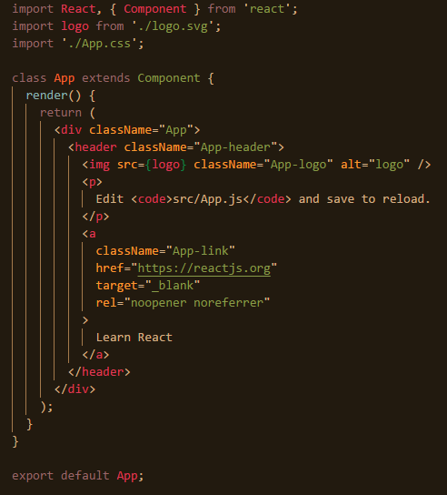

# 11월 05일 Entry Front-End 수업 내용 정리

## 리액트 프로젝트 생성
리액트를 사용하기 위해 기본적인 셋팅을 전에 끝냈으니 이제 **프로젝트를 생성할 차례**이다. 프로젝트를 생성을 하려면 다음과 같은 명령어를 사용하면 된다.

~~~
create-react-app (프로젝트 명)
~~~

이제 우리는 아주 멋진 리액트 프로젝트를 만들었다. 프로젝트를 만들었으니 이제는 이 프로젝트를 실행할 차례이다. 프로젝트 실행을 위해 경로를 리액트 프로젝트 파일로 이동시켜 다음과 같은 명령어를 사용하자.

~~~
npm start //혹은
yarn start //yarn을 사용할 시
~~~

이제 프로젝트가 시작되었다. 정상적으로 실행이 되었다면 디폴트값의 리액트 프로젝트 페이지가 뜬 것을 확인할 수 있을 것이다. 이제 리액트를 사용할 준비는 모두 끝났다.

## App.js
리액트 프로젝트를 생성했으니 이제 그 프로젝트를 응용해 웹페이지를 꾸며볼 차례다. 생성한 리액트 프로젝트 파일에서 src 파일로 들어가 **App.js**파일을 찾아보자. 아마 아래와 같은 모습일 것이다.  
  
프로젝트를 생성했으니, 이제 응용할 차례라고 했다. 그러기 위해 우리는 **기본적인 것들이 구현되어 있는 App.js파일을 예시로 사용 방법을 알아볼 것**이다. 첫 번째 줄부터 보도록 하자.  

~~~js
import React, { Component } from 'react';
~~~

  `import`는 무언가를 불러온다는 뜻이다. 즉, 리액트 패키지 중 **리액트와 그 내부의 컴포넌트라는 요소**를 불러온다는 의미이다.  

~~~js
import logo from './logo.svg';
~~~

  이 코드 또한 `'./logo.syg'`라는 요소를 **logo**라는 이름으로 불러온다는 뜻이다.  

~~~js
import './App.css';
~~~

  이 코드 역시 `'./App.css'`라는 요소를 불러온다는 뜻이다. css파일은 별다른 이름을 지정해주지 않아도 불러올 수 있다.  

~~~js
class App extends Component {
  render() {
    return (
        …
    );
  }
}
~~~

  이 코드는 class로 컴포넌트를 만든다는 뜻이다. 이름이 `App`인 클래스를 생성한 후, 상단에서 `'react'` 안에 불러왔던 `Components`라는 요소를 상속받았다는 의미이다. `class`안에서 `render()` 함수를 사용한 이유는 `class`안에서 사용하는 JSX 문법을 웹페이지에 띄워야 하기 때문이다. `rendar()`함수 안에서 `return();` 값으로 JSX 문법을 작성하는 것이 리액트의 기본이다.  

~~~js
export default App;
~~~

 마지막은 **내보내기**기능을 하는 코드인데, 어디에서던 이 컴포넌트를 사용하기 위해 이 파일을 내보내주는 것이다.